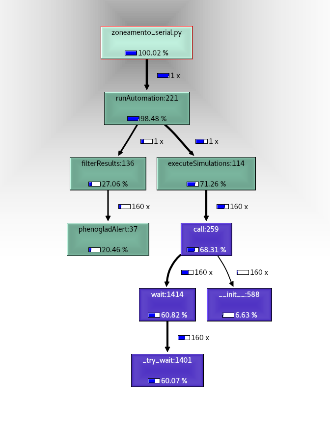
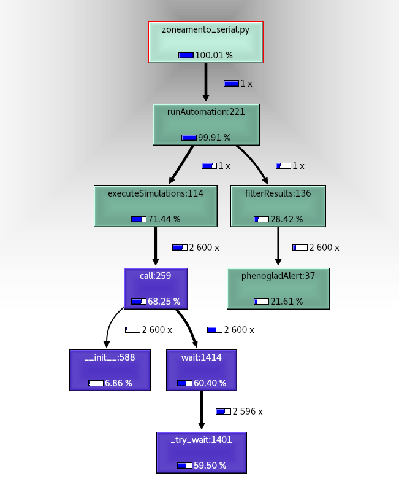

[Programação Paralela](https://github.com/AndreaInfUFSM/elc139-2018a) > Trabalhos

# T2: Experiências com Profilers

Aluno: Lucas Ferreira da Silva
Disciplina: ELC139 - Programação Paralela

## Sumário

- [Parte 1](#p1)
    - [Análise dos profiles obtidos](#p1-analise)
    - [Resultados obtidos](#p1-resultado)
- [Parte 2](#p2)
    - [Programa escolhido](#p2-programa)
    - [Profiles utilizados](#p2-profiles)
    - [Resultados](#p2-resultados)
        - [Resultados com o profile <i>Cprofile</i>](#p2-res-cprofile)
        - [Resultados com o profile <i>pprofile</i>](#p2-res-pprofile)
        - [Conclusões sobre os profiles](#p2-conc-profile)
        - [Conclusões sobre o perfil de execução do script](#p2-conc-script)
- [Referências](#ref)


<a name="p1"></a>

# Parte 1

<a name="p1-analise"></a>

### Análise dos profiles obtidos

Executando a aplicação \"dotprod_seq.c\" com diferentes números de repetições e diferentes tamanhos de vetor, é possível obter os seguintes gráficos, que expressam a relação existente entre os valores atribuidos aos parâmetros de execução e o tempo de execução do cálculo.

<div align="center">
    
    
</div>


Nos gráficos é possível notar que, tanto a relação tempo x repetições quanto a relação tempo x tamanho dos vetores, possuem gráficos que crescem exponencialmente conforme os valores dos parâmetros aumentam, o que acaba expressando a grande influência que os diferentes valores dos argumentos apresentam no perfil da execução.

```
"O perfil é afetado pelas opções de configuração?"
```

Respondendo a pergunta acima, sim, o perfil de execução é afetado pelas opções de configuração e, como relatado, os valores de configuração são diretamente proporcionais ao tempo total de execução, ou seja, quanto maiores os valores passados como argumento, maior será o tempo total de execução.

Sabendo do impacto dos \"distintos valores para tamanho dos vetores\" e dos \"distintos números de repetições\", foram coletados os perfis de excução para variadas configurações de execução, visando-se uma amostra do perfil para as seguintes \"categorias\":

#### 1) Tamanho dos vetores grande, poucas repetições
- Tamanho dos vetores: 30000000
- Número de repetições: 90

` ./dotprod_seq 30000000 90 `

#### 2) Tamanho dos vetores "pequeno", várias repetições
- Tamanho dos vetores: 3000
- Número de repetições: 1000000

` ./dotprod_seq 3000 1000000 `

#### 3) Tamanho dos vetores grande, várias repetições
- Tamanho dos vetores: 300000
- Número de repetições: 100000

` ./dotprod_seq 300000 100000 `

<a name="p1-resultado"></a>

### Resultados obtidos

Para a execução do profile Gprof, obteve-se os seguintes resultados:
<div align="center">

Configuração 1                 | Configuração 2                 | Configuração 3
------------------------------ | ------------------------------ | ------------------------------
 |  |      
[Profile conf. 1](profiles/gprof/gprof1.txt) | [Profile conf. 2](profiles/gprof/gprof2.txt) | [Profile conf. 3](profiles/gprof/gprof3.txt)

</div>

```
"Pelo perfil de execução, há alguma função que poderia ser candidata a paralelização? Por quê?"
```

Sim, há uma função que é fortemente candidata a paralelização, pois analisando os grafos gerados a partir do profile, é possível notar que a carga de trabalho está concentrada quase que totalmente na função \"dot_product\", responsável por realizar o cálculo, sendo que em algumas configurações de execução que demandam mais tempo de processamento (Configuração 2 e 3), as demais funções do algoritmo acabam influenciando em uma porcentagem muito pequena da execução, sendo até desconsideradas na criação do grafo por possuirem valores muito pequenos, quase insignificantes.

<a name="p2"></a>

# Parte 2

<a name="p2-programa"></a>

## Programa escolhido

O programa escolhido é um script Python que faz a automação das múltiplas execuções do modelo agrícola \"PhenoGlad\", alternando os dados de entrada referentes ao local de plantio, dia de início da simulação e ano de início da simulação. Os dados resultantes das múltiplas simulações são utilizados para realizar o zoneamento da cultivar de gladíolo para as inúmeras regiões aptas ao seu cultivo no Rio Grande do Sul.

A escolha foi motivada pelo tempo de execução da versão serial do programa que possui duração na unidade de minutos.

<a name="p2-profiles"></a>

## Profiles utilizados

Foram utilizados 2 profiles para Python, o <i>Cprofile</i> (nativo da linguagem) e o <i>pprofile</i> (desenvolvido como uma alternativa ao antigo line_profiler).


As execuções utilizando tanto o <i>Cprofile</i> quanto o <i>pprofile</i> foram configuradas de forma a se ter uma amostra de 3 tipos de execução característicos do script Python, são elas:

#### 1) Poucos dias e poucos anos:
- Número de dias: 10
- Número de anos: 15

#### 2) Considerável número de dias e poucos anos:
- Número de dias: 100
- Número de anos: 15

#### 3) Considerável número de dias e vários anos: 
- Número de dias: 100
- Número de anos: 25

<a name="p2-resultados"></a>

## Resultados
Neste tópico são apresentados os resultados obtidos com a execução de ambos os profiles executados.

<a name="p2-res-cprofile"></a>

### Resultados com o profile <i>Cprofile</i>
Executando o script com o profile <i>Cprofile</i> obeteve-se os seguintes grafos do perfil de execução:

Configuração 1                 | Configuração 2                 | Configuração 3
------------------------------ | ------------------------------ | ------------------------------
 |  | 

<a name="p2-res-pprofile"></a>

### Resultados com o profile <i>pprofile</i>
Executando o script com o profile <i>pprofile</i> obteve-se os seguintes grafos do perfil de execução:

Configuração 1                 | Configuração 2                 | Configuração 3
------------------------------ | ------------------------------ | ------------------------------
 |  | 


<a name="p2-conc-profile"></a>

## Conclusões sobre os profiles

Ambos os profiles escolhidos cumpriram muito bem sua tarefa, sendo que os dois geraram os resultados de forma clara, não foram muito intrusivos durante a execução do script e ainda apresentaram dados coerentes ao final das execuções. Contudo, o profile <i>Cprofile</i> resultou em informações de perfil de execução mais detalhadas, explorando de maneira mais aprofundada recursos como chamadas de sistema e E/S durante a execução. O <i>pprofile</i> talvez não tenha apresentado dados muito aprofundados para esse último quesito justamente por sua implementação que busca ser um profile Python mais "puro" e, por isso, acaba sendo afetado por algumas abstrações do sistema realizadas pelo interpretador Python.

<a name="p2-conc-script"></a>

## Conclusões sobre o perfil de execução do script

#### O perfil é afetado pelas opções de configuração?

Sim, porém não ao ponto de modificar significativamente a porcentagem de carga de trabalho destinada a cada função, influenciando apenas no tempo total de execução de forma diretamente proporcional ao número de dias e anos passados para o script.  

#### Pelo perfil de execução, há alguma função que poderia ser candidata a paralelização? Por quê?

Como fica evidente nos grafos de perfil de execução, é possível notar que dentre os principais funções do script (filterResults, executeSimulations e phenogladAlert) a função \"executeSimulations\" é responsável por, em média, 98% do tempo total de execução, sendo essa uma forte candidata a paralelização. Uma implementação paralela para essa função certamente melhoraria o desempenho do script, pois nela é realizada a parte mais custosa de toda a execução, sendo visível que o pior gargalo de desempenho está nas chamadas de sistema destinadas a execução do modelo agrícola.

<a name="ref"></a>

# Referências

- Introdução ao GPROF. https://www.ibm.com/developerworks/br/local/linux/gprof_introduction/index.html
- GNU gprof. http://sourceware.org/binutils/docs/gprof/
- Script para realização do zoneamento para a cultura do gladíolo. https://github.com/LucasFerreiraDaSilva/ScriptsPhenoGlad
- The Python Profilers. https://docs.python.org/3.7/library/profile.html
- Profiling Python using cProfile: a concrete case. https://julien.danjou.info/guide-to-python-profiling-cprofile-concrete-case-carbonara/
- Repositório <i>pprofile</i>. https://github.com/vpelletier/pprofile
- line_profiler and kernprof. https://github.com/rkern/line_profiler
- <i>pprofile</i> package. https://pypi.python.org/pypi/pprofile    