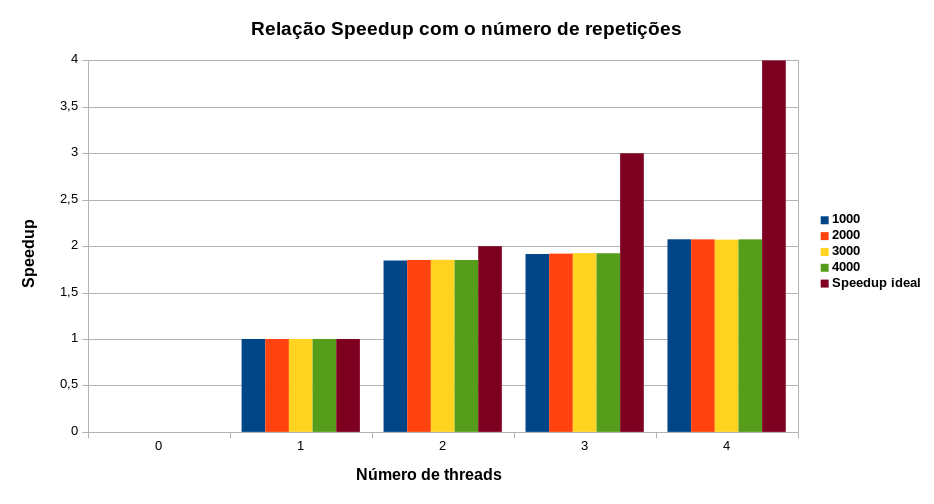
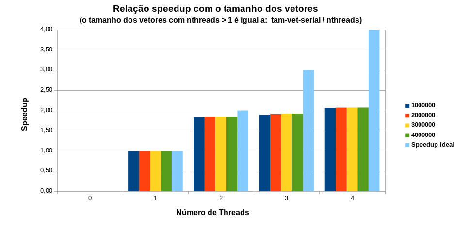
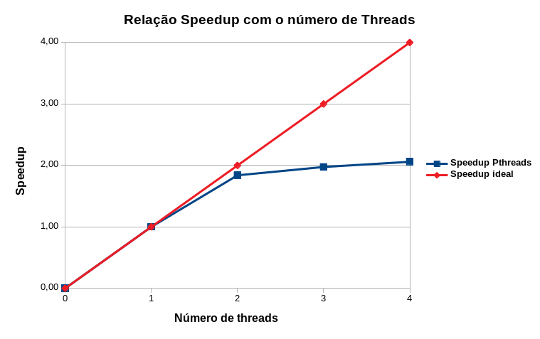

[Programação Paralela](https://github.com/AndreaInfUFSM/elc139-2018a) > Trabalhos

# T3: Programação Paralela Multithread

Aluno: Lucas Ferreira da Silva

Disciplina: ELC139 - Programação Paralela


## Sumário

- [Questões Pthreads](#pthread)
    - [Questão 1](#q1)
    - [Questão 2](#q2)
    - [Questão 3 e 4](#q3_4)
    - [Questão 5](#q5)
- [Implementação OpenMP](#openmp)
    - [Implementação do dotprod com OpenMP](#imp)
    - [Avaliação de desempenho](#aval)
- [Referências](#ref)

<a name="pthread"></a>

# Questões Pthreads

<a name="q1"></a>

## Questão 1

```
Explique como se encontram implementadas as 4 etapas de projeto: particionamento, comunicação, aglomeração, mapeamento (use trechos de código para ilustrar a explicação).
```

### a) Particionamento

Nesta etapa busca-se identificar as possibilidades de paralelismo e, para isso, faz-se necessária a decomposição de um problema "grande" em problemas menores para que seja possível a paralelização, pois cada thread poderá "resolver" um pedaço do problema grande e ao fim, a junção de todas soluções dos problemas pequenos sejam equivalentes a solução do problema antes de sua decomposição.

No problema do cálculo do produto escalar, a estratégia adotada na implementação com Pthreads é decompor cada vetor em vários segmentos para que cada thread possa trabalhar sobre cada parte do vetor de forma independente. Abaixo o trecho de código que deixa essa divisão mais explícita:  

``` c
    long offset = (long) arg;
    double *a = dotdata.a;
    double *b = dotdata.b;     
    int wsize = dotdata.wsize;
    int start = offset*wsize;
    int end = start + wsize;
```

No trecho de código acima estão as variáveis responsáveis por definir os limites do segmento do vetor que cada thread irá atuar. A seguir o significado das variáveis que definem esses limites.

<div align="center">

Variável | Funcionalidade
-------- | ----------------------------------------------------------
offset   | valor que representa qual segmento que se está trabalhando
wsize    | quantas posições do vetor que cada segmento contém 
start    | posição do vetor que representa a primeira posição do segmento
end      | posição do vetor que representa a última posição do segmento

</div>

Abaixo um trecho de código que utiliza as variáveis start e end para determinar o trecho do vetor que serão realizadas as multiplicações por determinada thread.

``` c
    for (i = start; i < end ; i++) ...
``` 

### b) Comunicação
A etapa de comunicação é a etapa a qual se destina a preocupação em tratar as dependências existentes entre cada segmento originado da etapa de particionamento, para que, ao final da execução, o resultado esperado da computação realizada por várias threads seja o mesmo da computação realizada serialmente.

No cálculo do produto escalar a dependência está na necessidade de se ter 2 valores para realização das multiplicações e também no cálculo das múltiplas somas, as quais dependem dos resultados das multiplicações. Para tratar essas dependências foi utilizado um mutex para tratar o acesso concorrente da estrutura de dados "dotdata", conforme o trecho de código abaixo;

``` c
    pthread_mutex_lock (&mutexsum);
    dotdata.c += mysum;
    pthread_mutex_unlock (&mutexsum);
``` 

### c) Aglomeração

A fase de aglomeração possui como meta obter um tempo de processamento maior que o tempo de comunicação durante a execução do algoritmo e, para tal, faz-se necessário que os dados manipuláveis do problema sejam "agrupados" de forma a eliminar o máximo de comunição e dependências possível, alcançando assim um melhor paralelismo.

No problema do produto escalar foi adotado como sulução de aglomeramento agrupar várias somas e multiplicações para se produzir somas parciais, que quando somadas no fim resultarão na solução do produto escalar. O trecho de código que explicita essa estratégia pode ser visualizado abaixo:

``` c
    double mysum;

    for (k = 0; k < dotdata.repeat; k++) {
        mysum = 0.0;
        for (i = start; i < end ; i++)  {
            mysum += (a[i] * b[i]);
        }
    }

    pthread_mutex_lock (&mutexsum);
    dotdata.c += mysum;
    pthread_mutex_unlock (&mutexsum);
```   

### d) Mapeamento

Nesta etapa preocupa-se com a distribuição da carga de trabalho para cada thread, ou seja, cada thread deve, preferencialmete, executar a mesma quantidade de tarefas, para que todas progridam de forma homogênea durante a execução e o paralelismo obtenha bons resultados de tempo. Essa distibuição pode ser tanto dinâmica quanto estática.

Na implementação do produto escalar utilizou-se um mapeamento estático, pois na fase de particionamento a divisão do vetor em segmentos é realizada dependendo do número de threads que se deseja criar, sendo que o vetor será dividido em um número de partes igual ao número de threads, fazendo com que todas as threads fiquem com um pedaço do vetor igual, ou mais semelhante possível.

``` c
    for (i = 0; i < nthreads; i++) {
        pthread_create(&threads[i], &attr, dotprod_worker, (void *) i);
    }
```

O trecho acima mostra a fase de criação das n threads que executarão o cálculo, nele é possível notar que na chamada de "pthread_create" é passado como parâmetro para a função dotprod_worker o número da thread que será criada "i". Na função dotprod_worker o "i" passado como parâmetro será o valor do offset que corresponde a qual pedaço do vetor que será realizado o cálculo, distribuindo assim para cada thread um pedaço distinto do vetor mas de mesmo tamanho.

<a name="q2"></a>

## Questão 2

```
Considerando o tempo (em segundos) mostrado na saída do programa, qual foi a aceleração com o uso de threads?
```

Considerando as seguintes execuções:

- Para 1 thread (execução sequencial):

```
    ./pthreads_dotprod 1 1000000 2000
```

- Para 2 threads (execução paralela):

```
    ./pthreads_dotprod 2 500000 2000
```

Para a realização do cálculo do speedup, visando uma maior corretude nos tempos de execução, foram realizadas 10 execuções de cada configuração e calculada a média dos tempos. Sendo assim obteve-se um tempo médio de 68526138 usec para a execução com uma thread e um tempo médio de 37079273 usec para a execução com 2 threads, portanto obteve-se um speedup de 1.84 vezes, quase que o speedup teórico ideal que é 2 vezes para 2 threads.

<a name="q3_4"></a>

## Questão 3 e 4

Questão 3: 

```
A aceleração (speedup) se sustenta para outros tamanhos de vetores, números de threads e repetições? Para responder a essa questão, você terá que realizar diversas execuções, variando o tamanho do problema (tamanho dos vetores e número de repetições) e o número de threads (1, 2, 4, 8..., dependendo do número de núcleos). Cada caso deve ser executado várias vezes, para depois calcular-se um tempo de processamento médio para cada caso. Atenção aos fatores que podem interferir na confiabilidade da medição: uso compartilhado do computador, tempos muito pequenos, etc.
```

Questão 4:

```
Elabore um gráfico/tabela de aceleração a partir dos dados obtidos no exercício anterior.
```

Para responder estas questões foram realizadas execuções variando o tamanho dos vetores, número de repetições e número de threads, sendo que cada combinação de configuração foi executada 10 vezes e obtido a média dos valores de tempo.

A partir dos resultados obtidos foi possível gerar 3 gráficos para a análise da influência da variação de cada um dos parâmetros do algoritmo, os quais são apresentados a seguir.

<div align="center">



</div>

<div align="center">



</div>
Analisando os dois gráficos acima pode-se concluir que, independente do número de repetições ou tamanho dos vetores passados por parâmetro na execução do algoritmo, o speedup não sofre influência em seu valor, o que é evidenciado pelo crescimento proporcional e homogêneo das barras do gráfico.

Entretanto, quando varia-se o número de threads o speedup é influenciado diretamente, sendo que o speedup cresce proporcionalmente ao número de threads, porém a medida que o número de threads se aproxima do número de processadores da máquina o valor de speedup tende a estagnar seu crecimento. O gráfico abaixo ilustra a relação existente entre o speedup e o número de threads.

<div align="center">



</div>

<a name="q5"></a>

## Questão 5

```
Explique as diferenças entre pthreads_dotprod.c e pthreads_dotprod2.c. Com as linhas removidas, o programa está correto?
```

A diferença existente nos dois códigos é o tratamento do acesso a região crítica (estrutura global dotdata) por meio da utilização de mutexes como estratégia de garantia de exclusão mútua. Isso é necessário porque mesmo que a operação de soma seja comutativa (independente da ordem dos fatores a concistência do resultado final é grantida), várias threads acessando essa mesma estrutura concorrentemente pode ocasionar em problemas de concistência e atomicidade deixando o resultado final suscetível a erros (de certa forma raros nesse caso mas possíveis) ocasionados por inanição ou deadlocks. Portanto com a utilização do mutex garante-se que não existirão mais de uma thread acessando a estrutura ao mesmo tempo, fazendo dessa implementação mais correta e segura. 

O código abaixo mostra a utilização do mutex em uma das implementações:

``` c
    pthread_mutex_lock (&mutexsum);
    dotdata.c += mysum;
    pthread_mutex_unlock (&mutexsum);
```

<a name="openmp"></a>

# Implementação OpenMP

<a name="imp"></a>

## Implementação do dotprod com OpenMP

A implementação da versão paralela do produto escalar utilizando OpenMP baseou-se na versão seria, sem os recursos de threads POSIX. Desta forma, pensando em uma implementação equivalente a implementação com pthreads, foi paralelizado somente o seguinte trecho de código:

``` c
    
    /*
    * Calcula o produto escalar (varias vezes)
    */
    double dot_product(double *a, double *b, int n, int repeat)
    {
        double dot;

        for (int k = 0; k < repeat; k++)
        {
            dot = 0.0;
            for (int i = 0; i < n; i++)
            {
                dot += a[i] * b[i];
            }
        }
        return dot;
    }
```

Analisando a função dot_product percebe-se que a variável dot é zerada a cada iteração do laço mais externo, o que faz com que a mesma seja reescrita a cada repetição (repeat) do cálculo do produto escalar, sendo que o valor resultante será sempre o valor de dot calculado na última iteração do laço mais externo. Essa pequena análise do comportamento do cálculo possibilitou a escolha da estratégia de paralelismo com OpenMP, sendo então utilizada a seguinte combinação de diretivas:

``` c
    #pragma omp parallel for lastprivate(dot)
```

Embora comumente pouco utilizada, a diretiva lastprivate() é perfeita para o problema em questão, pois ao utilizar-se a mesma combinada com a paralelização do laço, faz com que para cada thread se tenha uma cópia da variável dot, porém o OpemMP automaticamente encarrega-se de conservar somente o resultado de dot para a última thread que possui uma cópia de dot. Além disso essa implementação evita a criação de regiões críticas desnecessárias em cada iteração do laço, já que cada cópia de dot será privada de cada thread, melhorando ainda mais o desempenho.

Abaixo a função dot_product paralelizada com diretivas OpenMP:

``` c
    double dot;
    
    #pragma omp parallel for lastprivate(dot)
    for (int k = 0; k < repeat; k++)
    {
        dot = 0.0;
        for (int i = 0; i < n; i++)
        {
            dot += a[i] * b[i];
        }
    }
    return dot;
```


<a name="aval"></a>

## Avaliação de desempenho

Faltou terminar os gráficos, porém, a implementação utilizando a diretiva lastprivate() melhorou consideravelmente o desempenho em relação a implementação com pthreads.

<a name="ref"></a>

# Referências

- Projeto de programas paralelos. https://docs.google.com/presentation/d/1nvYuUXBmqQPoicRI8yfqMxxAVtRveTtMWJV0Cq6mSR4/export/pdf
- Programação com OpenMP. https://docs.google.com/presentation/d/1Wim7xC-X4qAo0jYCm3A4yzRpaHBl_z7yIlvzPUgT0x0/export/pdf
- OpenMP Examples guide 4.5. http://www.openmp.org/wp-content/uploads/openmp-examples-4.5.0.pdf
- Introdução ao OpenMP. https://www.dcc.fc.up.pt/~fds/aulas/PPD/0708/intro_openmp-1x2.pdf
- OpenMP Tutorial. https://idre.ucla.edu/sites/default/files/intro-openmp-2013-02-11.pdf
- OpenMP Clauses. https://www.dartmouth.edu/~rc/classes/intro_openmp/OpenMP_Clauses.html
