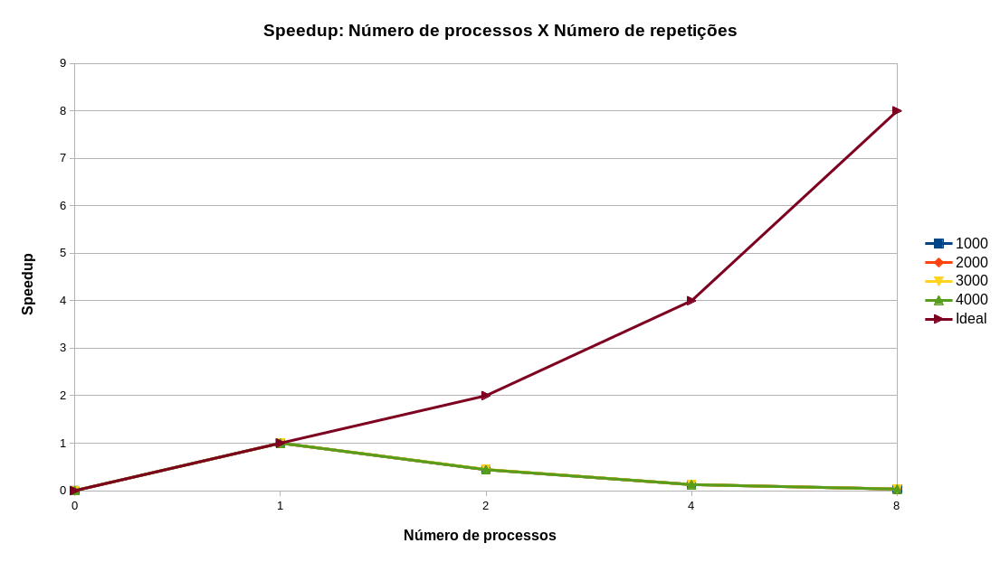
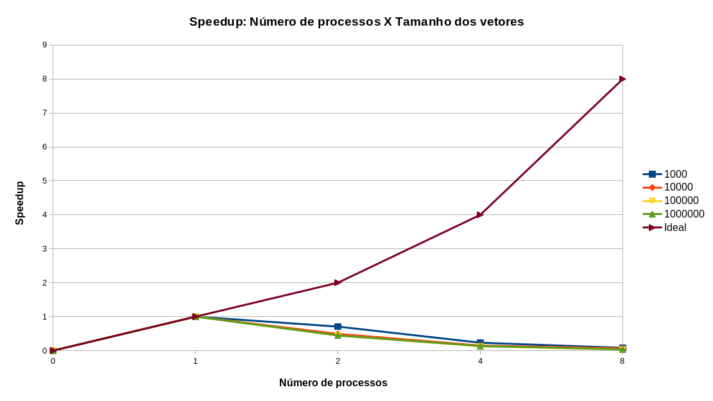

[Programação Paralela](https://github.com/AndreaInfUFSM/elc139-2018a) > Trabalhos

# T7: Primeiros passos com MPI

Aluno: Lucas Ferreira da Silva

Disciplina: ELC139 - Programação Paralela


## Sumário

- [Parte 1](#pt1)
- [Parte 2](#pt2)
- [Parte 3](#pt3)
    - [Programa 1](#prog1)
    - [Programa 2](#prog2)
- [Referências](#ref)

<a name="pt1"></a>

# Parte 1

```
Implemente uma versão em MPI do programa do trabalho t3, que calcula repetidas vezes o produto escalar entre 2 vetores. Os argumentos do programa devem ser: o número de elementos para cada processo e o número de repetições.

Avalie o desempenho do programa conforme as instruções do trabalho t3, mas usando processos ao invés de threads.
```
Assim como na implementação do trabalho 3, para o presente trabalho foi utilizado como base a versão serial do programa dotprod para a criação de uma versão do programa [dotprod com MPI](dotprod_mpi.c).

Após feitas as adaptações no código, foram realizadas execuções variando o tamanho dos vetores, número de repetições e número de processos, sendo que cada combinação de configuração foi executada 10 vezes e obtido a média dos valores de tempo.

A partir dos resultados obtidos foi possível gerar 2 gráficos para a análise da influência da variação de cada um dos parâmetros do algoritmo, os quais são apresentados a seguir.

<div align="center">



</div>

<div align="center">



</div>

Analisando-se apenas os gráficos nota-se que em ambas as análise, tanto comparando-se número de repetições quanto tamanho dos vetores com o número de processos, quanto maior o número de processos, maior é a queda de desemprenho, o que acabou por mostrar um comportamento inesperado para a implementação, já que em nenhum momento o speedup foi superior a 1, o que é evidentemente estranho.

Entretanto, com esses dados demonstrando resultados anormais, foi realizada a execução de todos os testes novamente, porém, em outra máquina, e novamente os resutados foram muito semelhantes. Sendo assim tentou-se adaptar o código para que o cálculo de tempo fosse mais preciso para cada processo, por mais que os processos não são assíncronos, a nova estratégia de captura do tempo, calcula o tempo individual do cálculo do dotprod de cada processo e manda esse tempo via MPI_Send para o processo principal o qual fica responsável por realizar o somatório que representa todo o tempo gasto no cálculo do dotprod. Contudo, mais uma vez, as execuções desencadearam na conclusão dos resultados anteriores e a dúvida sobre o que pode estar errado na implementação ainda permanece, porém, ainda desconfia-se que há uma confusão ou erro na hora de implementar as coletas de tempo.

O [arquivo](output.txt) com a saída de todas as execuções e seus respectivos tempos da última tentativa foi anexado ao repositório para comprovar os resultados anormais obtidos.

<a name="pt2"></a>

# Parte 2

```
Implemente um programa MPI que transporte uma mensagem em um pipeline formado por processos de 0 a NP-1 (processo 0 envia para 1, processo 1 envia para 2, ..., processo NP-1 mostra o resultado). A mensagem é um número inteiro que é incrementado antes de ser passado adiante.
```

O programa [pipeline_mpi.c](pipeline_mpi.c) implementa o pipeline descrito no texto acima.

Como definiu-se que o processo 0 iniciaria com a mensagem com valor = 0 e o número de processos é definido via o parâmetro -np do mpiexec, não é necessário informar nenhum argumento para o executável do programa [pipeline_mpi.c](pipeline_mpi.c).

Abaixo um exemplo de saída para um pipeline de 10 processos:

**Comando:**
```
mpiexec -np 10 pipeline_mpi
```

**Saída:**
```
[Processo 0] Enviando mensagem com valor '0' ao processo 1!
[Processo 1] Recebida a mensagem: '0' - Enviando ao processo 2 a mensagem: '1'!
[Processo 2] Recebida a mensagem: '1' - Enviando ao processo 3 a mensagem: '2'!
[Processo 3] Recebida a mensagem: '2' - Enviando ao processo 4 a mensagem: '3'!
[Processo 4] Recebida a mensagem: '3' - Enviando ao processo 5 a mensagem: '4'!
[Processo 5] Recebida a mensagem: '4' - Enviando ao processo 6 a mensagem: '5'!
[Processo 6] Recebida a mensagem: '5' - Enviando ao processo 7 a mensagem: '6'!
[Processo 7] Recebida a mensagem: '6' - Enviando ao processo 8 a mensagem: '7'!
[Processo 8] Recebida a mensagem: '7' - Enviando ao processo 9 a mensagem: '8'!
[Processo 9] Valor da mensagem recebida: '8'

```

**Observação:** Por padrão, alguns sistemas não permitem a execução de um programa MPI que aloque mais processos do que o número de núcleos disponíveis no processador, para permitir que isso seja possível é necessário setar a seguinte variável de ambiente:

```
export OMPI_MCA_rmaps_base_oversubscribe=1
```

<a name="pt3"></a>

# Parte 3

<a name="prog1"></a>

## Programa 1
+ O programa [mpi_errado1.c](mpi_errado1.c) deveria realizar a troca de mensagens entre 2 processos, mas ele não funciona como esperado. Identifique o erro e corrija-o.

O problema do programa [mpi_errado1.c](mpi_errado1.c) que faz com que o mesmo não execute corretamente é o valor passado para a variável tag no MPI_Send e no MPI_Recv, pois o valor da tag é diferente em ambos processos, o que faz com que um processo remetente mande uma mensagem para um processo destinatário com uma tag que o receptor não está "esperando" e, consequentemente, ignora a mensagem.

O programa [mpi_correto1.c](mpi_correto1.c) faz a correção do valor da variável tag, atribuindo um único valor para a mesma, solucionando o problema.

<a name="prog2"></a>

## Programa 2
+ O programa [mpi_errado2.c](mpi_errado2.c) deveria realizar a troca de mensagens entre 2 processos, mas também não funciona como esperado. Identifique o erro e corrija-o.

O problema deste programa pode facilmente ser identificado ao se tentar executar o mesmo, pois o próprio MPI acusa a falta de uma função para o encerramento do MPI e, ao olhar o código, de cara pode-se perceber que está faltando a chamada da função MPI_Finalize() antes de se sair do programa, impedindo assim o funcionamento correto ou o não funcionamento do programa.

O programa [mpi_correto2.c](mpi_correto2.c) faz a adição da chamada a função MPI_Finalize() ao fim de sua execução, solucionando o problema.


<a name="ref"></a>

# Referências

- [Tutorial MPI](https://computing.llnl.gov/tutorials/mpi/)  
  Tutorial do Lawrence Livermore National Laboratory (LLNL) sobre MPI.

- [Documentação MPI](https://www.open-mpi.org/doc/v3.1/)  
  Open MPI v3.1.0 documentation  

- [MPI Tutorial](http://mpitutorial.com/tutorials/mpi-send-and-receive/)  
  MPI Send and Receive